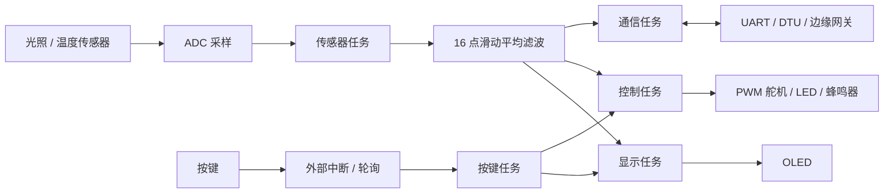

# smart-env-monitor

> 面向嵌入式软件开发的项目实践仓库，当前重点展示基于 STM32 与 FreeRTOS 的室内环境智能感知与调控系统。

## 项目一：智能环境监控器

[`smart_env_monitor`](smart_env_monitor/) 是一个运行在 **STM32F103C8T6** 上的 FreeRTOS 项目。它采集室内光照与温度数据，在 OLED 上显示状态，并根据运行模式控制舵机、LED 与蜂鸣器；同时经由 UART 与 DTU/边缘网关交换遥测数据和控制指令。

**关键词：** STM32F103C8T6 · C · FreeRTOS · ADC · DMA · GPIO · PWM · UART · OLED · JSON · Keil MDK · STM32CubeMX

| 能力点 | 项目中的实现 |
| --- | --- |
| 多任务协同 | 将采集、显示、控制、通信、按键处理拆分为独立 FreeRTOS 任务。 |
| 环境感知 | 基于 ADC 采集光照与温度模拟量，使用 16 点滑动平均滤波降低抖动。 |
| 实时控制 | 自动模式依据阈值联动舵机、LED 与蜂鸣器；手动模式支持调整舵机 PWM 脉宽。 |
| 设备交互 | OLED 实时显示环境数据和模式；按键支持自动、手动、设置三种工作模式。 |
| 数据通信 | UART 定时上报 JSON 遥测数据，并解析网关下发的模式、舵机和 LED 控制指令。 |

详细的工程结构、构建方式与硬件说明见：[智能环境监控器 README](smart_env_monitor/README.md)。

## 系统设计



### 任务与事件模型

系统采用“周期任务 + 事件唤醒”的方式平衡实时性与资源消耗：

- **传感器任务**读取 ADC 数据、完成滤波并更新全局状态；光照与温度保留原始值和换算后的工程值。
- **显示任务**只在数值或模式变化时刷新 OLED，减少不必要的显示写入。
- **控制任务**每 200 ms 根据模式与阈值驱动执行器：光照不足时调整舵机并点亮告警 LED，温度超限时切换状态指示。
- **按键任务**通过中断释放信号量处理模式键，同时对设置键进行边沿检测与消抖。
- **通信任务**按 5 秒周期上报 JSON 遥测数据；当 DTU 连续异常时执行复位并重新初始化通信。

### 工作模式

| 模式 | 作用 |
| --- | --- |
| 自动模式 | 根据光照、温度阈值自动调节舵机与指示灯。 |
| 手动模式 | 通过按键或 UART 指令将舵机 PWM 脉宽设为 500–2500 μs。 |
| 设置模式 | 调整光照和温度阈值后返回自动模式。 |

## 仓库结构

```text
programfirst/
├── smart_env_monitor/  # STM32 + FreeRTOS 智能环境监控项目
├── 参考文档/            # 芯片、模块和项目参考资料
└── 现有模块列表/        # 已有硬件模块清单
```

## 快速开始

1. 进入 [`smart_env_monitor`](smart_env_monitor/) 目录。
2. 使用 Keil MDK-ARM 打开 `MDK-ARM/smart_env_monitor.uvprojx`。
3. 安装 STM32F1 Device Family Pack，连接 ST-Link 后编译、下载。
4. 使用串口工具查看调试日志，并按项目 README 配置外设连接。

## 后续计划

- 补充硬件连接图、实物照片与运行演示视频。
- 完善 UART JSON 协议文档与网关联调示例。
- 增加单元化驱动接口与更清晰的配置参数，便于迁移至其他 STM32 平台。

---

本仓库用于记录嵌入式项目实践与持续迭代过程。
