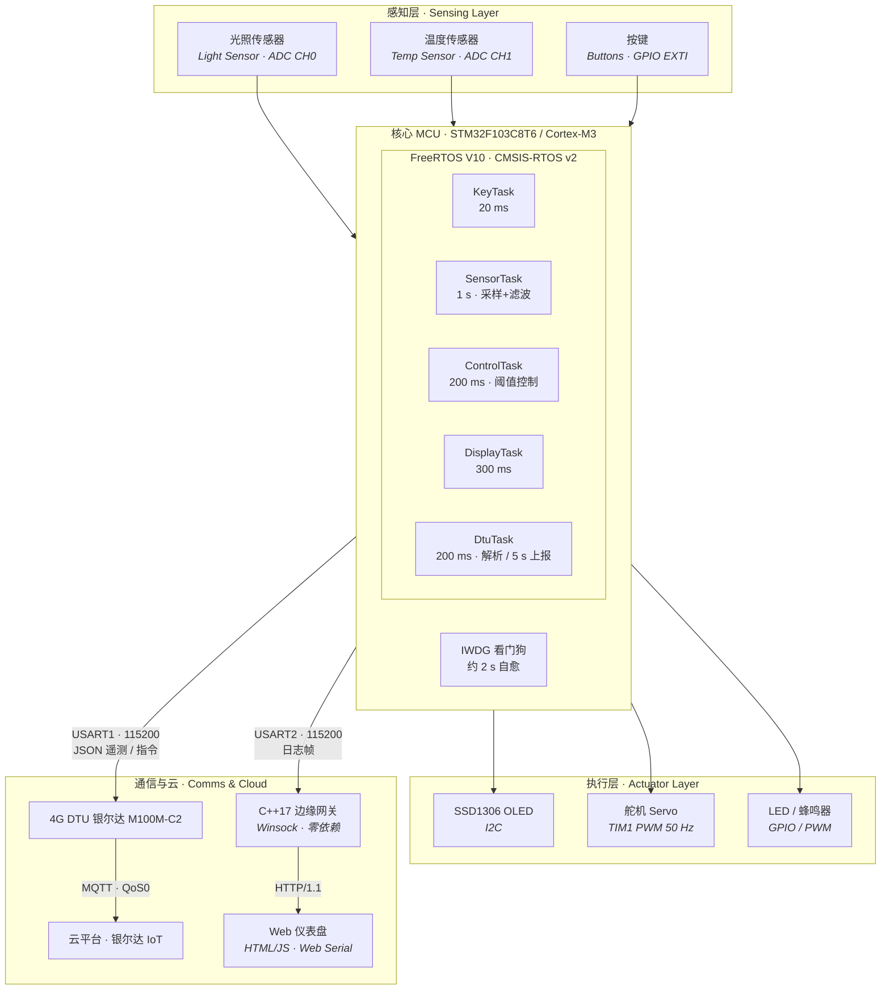
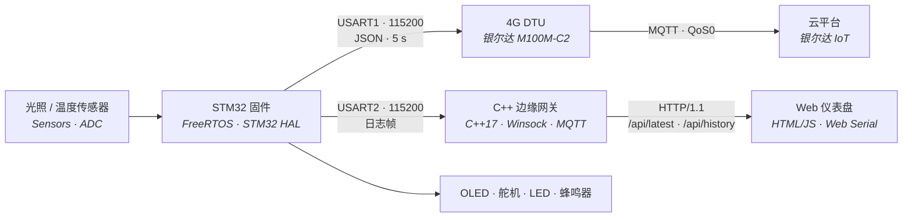

<div align="center">

# 🌿 Smart Env Monitor

**基于 STM32F103C8T6 与 FreeRTOS 的室内环境智能感知与调控系统**

<p>
  
  
  
  
</p>
<p>
  
  
  
  
  
</p>

环境采集 · OLED 显示 · 多任务调度 · 阈值控制 · UART/JSON 网关联动 · DTU MQTT 上云

[项目简介](#-项目简介) · [技术栈](#-技术栈) · [系统设计](#-系统设计) · [任务模型](#-freertos-任务模型) · [工作模式](#-工作模式) · [通信协议](#-通信协议) · [端到端数据链路](#-端到端数据链路) · [性能指标](#-性能指标) · [快速开始](#-快速开始)

</div>

---

## 📖 项目简介

Smart Env Monitor 是一个运行在 **STM32F103C8T6** 上的嵌入式环境监控项目。系统采集光照与温度模拟量，经 16 点滑动平均滤波后在 OLED 上显示，并根据自动、手动或设置模式联动舵机、LED 与蜂鸣器。设备通过 USART 接入 4G DTU 与 C++ 边缘网关，实现遥测数据上云和远程控制。

> 项目重点不只是"读取传感器"，而是完整实现了从 **数据采集 → 实时调度 → 状态展示 → 执行器控制 → 网关通信 → 云端上报** 的闭环链路。

## ✨ 功能亮点

| | 功能 | 实现方式 |
| --- | --- | --- |
| 🌡️ | 环境感知 | ADC 双通道采集光照与温度，16 点滑动平均滤波降低抖动。 |
| ⚙️ | 实时调度 | FreeRTOS/CMSIS-RTOS v2 拆分采集、显示、控制、通信和按键 5 个任务。 |
| 🖥️ | 本地交互 | SSD1306 OLED 显示数据与模式，按键支持模式切换、阈值设置和舵机调节。 |
| 🎛️ | 自动控制 | 按光照、温度阈值联动 PWM 舵机、状态 LED、告警 LED 与蜂鸣器。 |
| 📡 | 网关通信 | USART1/USART2 双通道环形缓冲，UART JSON 遥测上报与控制指令解析，连续指令不丢帧。 |
| ☁️ | 云端上报 | 经 4G DTU（银尔达 M100M-C2）MQTT 上报云平台；C++ 边缘网关 HTTP API + MQTT 二次上报。 |
| 🛡️ | 异常恢复 | IWDG 看门狗约 2 s 超时，任务死循环/故障自动硬件复位自愈。 |
| 🔍 | 可观测性 | 任务栈水位（`[STACK]`）、命令接收统计（`lines/overflow`）每 5 s 实测输出。 |

## 🛠️ 技术栈

| 层 | 技术栈 | 说明 |
| --- | --- | --- |
| 感知层 · Sensing | `ADC` · `GPIO EXTI` | 光照/温度 12-bit 双通道采样，16 点滑动平均滤波；按键事件唤醒 |
| 计算层 · Compute | `STM32F103C8T6` · `FreeRTOS` · `CMSIS-RTOS v2` | Cortex-M3 + STM32 HAL，周期任务调度 + IWDG 硬件自愈 |
| 执行层 · Actuator | `SSD1306` · `TIM PWM` | I2C OLED 显示；TIM1 PWM 50 Hz / 500–2500 µs 舵机；LED、蜂鸣器 |
| 通信层 · Comms | `USART` · `JSON` · `MQTT` | USART1/2 @ 115200 双通道，`dup` JSON 遥测，DTU MQTT 上云 |
| 网关层 · Gateway | `C++17` · `Winsock` | 零第三方依赖：串口解析 → 互斥保护缓存（120 条）→ HTTP API → MQTT 发布 |
| 呈现层 · UI | `HTML/JS` · `Web Serial` | 网关内置仪表盘（HTTP）+ `demo_dashboard` Web Serial 直连串口 |
| 工程化 · CI | `GitHub Actions` · `MSVC/gcc-arm-none-eabi` | 网关构建 + `--self-test` 门禁；固件编译门禁 |

## 🧩 系统设计

<div align="center">


```mermaid
flowchart TB
    subgraph SENSE["感知层 · Sensing Layer"]
        L["光照传感器<br/><i>Light Sensor · ADC CH0</i>"]
        T["温度传感器<br/><i>Temp Sensor · ADC CH1</i>"]
        K["按键<br/><i>Buttons · GPIO EXTI</i>"]
    end

    subgraph MCU["核心 MCU · STM32F103C8T6 / Cortex-M3"]
        subgraph OS["FreeRTOS V10 · CMSIS-RTOS v2"]
            direction LR
            TK["KeyTask<br/>20 ms"]
            TS["SensorTask<br/>1 s · 采样+滤波"]
            TC["ControlTask<br/>200 ms · 阈值控制"]
            TD["DisplayTask<br/>300 ms"]
            TU["DtuTask<br/>200 ms · 解析 / 5 s 上报"]
        end
        WDT["IWDG 看门狗<br/>约 2 s 自愈"]
    end

    subgraph ACT["执行层 · Actuator Layer"]
        O["SSD1306 OLED<br/><i>I2C</i>"]
        S["舵机 Servo<br/><i>TIM1 PWM 50 Hz</i>"]
        E["LED / 蜂鸣器<br/><i>GPIO / PWM</i>"]
    end

    subgraph COM["通信与云 · Comms & Cloud"]
        DTU["4G DTU 银尔达 M100M-C2"]
        GW["C++17 边缘网关<br/><i>Winsock · 零依赖</i>"]
        CLOUD["云平台 · 银尔达 IoT"]
        WEB["Web 仪表盘<br/><i>HTML/JS · Web Serial</i>"]
        DTU -->|"MQTT · QoS0"| CLOUD
        GW -->|"HTTP/1.1"| WEB
    end

    L --> MCU
    T --> MCU
    K --> MCU
    MCU --> O
    MCU --> S
    MCU --> E
    MCU -->|"USART1 · 115200<br/>JSON 遥测 / 指令"| DTU
    MCU -->|"USART2 · 115200<br/>日志帧"| GW
```

<sub>分层架构：感知 → 调度 → 执行 → 通信，每条链路的协议与速率标注在边上（GitHub 原生渲染 Mermaid）</sub>

</div>

设计上采用"**周期任务 + 事件唤醒**"的组合方式：连续数据由周期任务处理，模式按键通过外部中断释放信号量，设置按键通过边沿检测与消抖处理。这样既保证控制响应，又避免所有逻辑堆积在主循环中。

## 🧵 FreeRTOS 任务模型

| 任务 | 优先级 | 运行节拍 | 职责 |
| --- | --- | --- | --- |
| `KeyTask` | High | 20 ms | 响应模式键事件，轮询设置键并完成 30 ms 消抖。 |
| `SensorTask` | AboveNormal | 1000 ms | ADC 采样、16 点滤波、数据换算与调试输出。 |
| `ControlTask` | AboveNormal | 200 ms | 根据工作模式和阈值控制舵机与 LED。 |
| `DisplayTask` | Normal | 300 ms | 在状态变化时刷新 OLED，减少重复写入。 |
| `DtuTask` | BelowNormal | 200 ms | 解析指令（DTU/调试口双通道环形缓冲），按 5 秒周期上报遥测数据。 |

任务创建、优先级和核心业务逻辑集中在 [`Core/Src/freertos.c`](smart_env_monitor/Core/Src/freertos.c)。

## 🎚️ 工作模式

| 模式 | 行为 |
| --- | --- |
| **AUTO** | 光照低于阈值时驱动舵机并点亮告警 LED；温度超过阈值时切换状态指示。 |
| **MANUAL** | 通过按键或 UART 指令调整舵机 PWM，脉宽限制在 500–2500 μs。 |
| **SET** | 分步调整光照与温度阈值，保存后回到自动模式。 |

## 📡 通信协议

设备通过 USART 与 DTU/边缘网关通信，遥测数据采用 JSON 格式。

**上行遥测示例**

```json
{
  "cmd": "dup",
  "did": "0",
  "times": "123456000",
  "param": {
    "light": 62,
    "temp": 27,
    "mode": 0,
    "sw1": 0,
    "in1": 0,
    "vin": 0
  }
}
```

**支持的下行控制指令**（需以 `\r\n` 结尾）

```text
MODE=AUTO
MODE=MANUAL
SERVO=1500
LED=ON
LED=OFF
```

完整协议、引脚接线表与调试口说明见 [固件 README](smart_env_monitor/README.md)。

## 🔁 端到端数据链路


```mermaid
flowchart LR
    S["光照 / 温度传感器<br/><i>Sensors · ADC</i>"] --> F["STM32 固件<br/><i>FreeRTOS · STM32 HAL</i>"]
    F -->|"USART1 · 115200<br/>JSON · 5 s"| D["4G DTU<br/><i>银尔达 M100M-C2</i>"]
    F -->|"USART2 · 115200<br/>日志帧"| G["C++ 边缘网关<br/><i>C++17 · Winsock · MQTT</i>"]
    D -->|"MQTT · QoS0"| C["云平台<br/><i>银尔达 IoT</i>"]
    G -->|"HTTP/1.1<br/>/api/latest · /api/history"| W["Web 仪表盘<br/><i>HTML/JS · Web Serial</i>"]
    F --> O["OLED · 舵机 · LED · 蜂鸣器"]
```

两条上行通道并行独立：**DTU 通道**（USART1 → MQTT → 云平台，设备侧 5 s 心跳）与**网关通道**（USART2 → C++17 网关 → HTTP API / MQTT 二次上报 → Web 仪表盘），任一链路故障不影响另一条。

## 🔧 硬件与软件

| 类别 | 选型 / 配置 |
| --- | --- |
| MCU | STM32F103C8T6，ARM Cortex-M3 |
| RTOS | FreeRTOS，CMSIS-RTOS v2 接口 |
| 输入 | ADC 通道 0/1、模式键、设置键 |
| 输出 | SSD1306 OLED、TIM1 PWM 舵机、状态 LED、告警 LED、蜂鸣器 |
| 通信 | USART1（DTU，115200）、USART2（调试/网关，115200） |
| 可靠性 | IWDG 看门狗（约 2 s 超时） |
| 工具链 | STM32CubeMX、Keil MDK-ARM、ST-Link |

<details>
<summary><strong>查看 STM32F103C8T6 引脚参考图</strong></summary>

<br>


</details>

## 📊 性能指标

实测资源占用（Keil MDK-ARM 链接器 `.map` 输出，AC5 优化开启）：

| 指标 | 数值 | 说明 |
| --- | --- | --- |
| Flash 占用 | **24.87 KB / 64 KB（39%）** | 链接器 `Total ROM Size` |
| RAM 占用 | **15.38 KB / 20 KB（77%）** | 链接器 `Total RW Size`（RW+ZI），余量约 4.6 KB |
| 传感器采样周期 | 1 s | 16 点滑动平均滤波 |
| 遥测上报周期 | 5 s | USART1 输出 `dup` JSON |
| 舵机 PWM | 50 Hz，500–2500 μs | TIM1 预分频 71 / 周期 19999 |
| 命令接收 | 不丢帧 | USART1/2 环形缓冲实测 5 条连续指令 0 丢失 |

> 任务栈水位由板上 `[STACK]` 日志每 5 s 实测输出（`osThreadGetStackSpace`）；精确采样抖动为后续补充项。

## 📁 仓库结构

本仓库是**嵌入式全链路实践**集合：从 STM32 下位机固件，到 C++ 边缘网关与 Web 仪表盘，再到 DTU 上云与比赛材料。

```text
programfirst/
├── smart_env_monitor/        # STM32F103C8T6 + FreeRTOS 固件（采集/显示/控制/通信）
├── zhijing_edge_gateway/     # C++17 边缘网关（串口解析 / HTTP API / MQTT 上报）
├── demo_dashboard/           # 浏览器 Web Serial 实时仪表盘
├── 参赛材料/                 # 物联网设计大赛答辩材料（架构图 / 视频文案 / DTU 脚本）
├── docs/                     # 系统设计文档
├── tools/                    # 比赛材料生成脚本（一次性工具）
├── 日志截图/                 # 设备运行日志与数据截图
├── 参考文档/                 # 芯片与项目参考资料
└── 现有模块列表/             # 已有硬件模块清单
```

## 🚀 快速开始

### 环境准备

- Keil MDK-ARM
- STM32F1 Device Family Pack
- STM32CubeMX（需要修改外设配置时）
- ST-Link 与串口调试工具

### 构建与烧录

1. 克隆仓库并进入工程目录。
2. 使用 Keil 打开 `smart_env_monitor/MDK-ARM/smart_env_monitor.uvprojx`。
3. 选择正确的下载器与目标芯片 `STM32F103C8T6`。
4. 编译工程并通过 ST-Link 下载到开发板。
5. 打开串口工具查看传感器、DTU 和控制日志。

```bash
git clone https://github.com/Indulge125/smart-env-monitor.git
cd smart-env-monitor/smart_env_monitor
```

### 网关与仪表盘

```bash
# 构建（Windows，CMake + MSVC）
cmake -S zhijing_edge_gateway -B build -A x64
cmake --build build --config Release

# 自测 + 启动（默认 COM8/115200/8080，也可双击 启动网关.bat）
build\Release\zhijing_edge_gateway.exe --self-test
build\Release\zhijing_edge_gateway.exe COM14 115200 --web 8080
# 浏览器打开 http://localhost:8080 查看实时仪表盘
```

## 🗺️ 后续计划

- 将传感器、显示、通信接口进一步模块化，降低任务代码耦合。
- 增加参数持久化，使阈值与模式在重新上电后保留。
- 温度传感器标定（当前为 ADC 线性估计，仅演示相对变化）。
- 固件逻辑抽纯函数层 + 主机侧单元测试，配合现有编译门禁。

## 📬 联系方式

如需交流项目、嵌入式开发或合作，可发送邮件至 [1156852317@qq.com](mailto:1156852317@qq.com)。

---

<div align="center">

如果这个项目对你有帮助，欢迎通过 Issue 提出建议。

Made with embedded C and FreeRTOS by [Indulge125](https://github.com/Indulge125)

</div>
